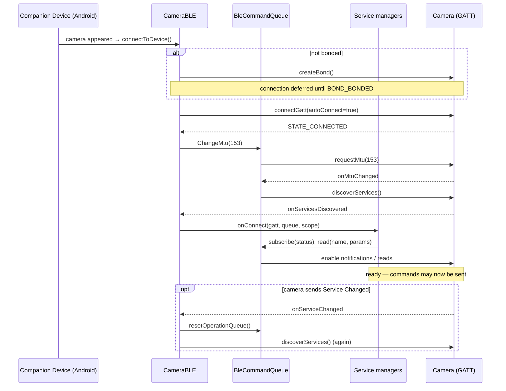
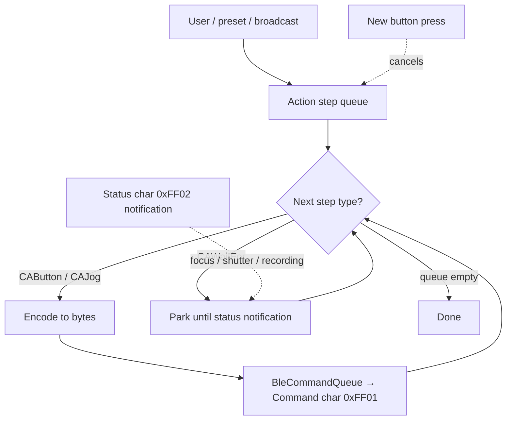

# Sony Alpha BLE Protocol

This document describes the Bluetooth Low Energy (BLE) protocol α-Remote uses to talk to
Sony Alpha cameras, as implemented in
[`org/staacks/alpharemote/camera/ble/`](../app/src/main/java/org/staacks/alpharemote/camera/ble).
It is a reference for anyone extending the app or reverse-engineering the camera side.

The protocol was documented by others first. This app's implementation stands on the shoulders of:

- **coral / freemote** — <https://github.com/coral/freemote>
- **Greg Leeds** — <https://gregleeds.com/reverse-engineering-sony-camera-bluetooth/>
- **Mark Kirschenbaum** — <https://gethypoxic.com/blogs/technical/sony-camera-ble-control-protocol-di-remote-control>

> **Scope of the protocol.** Control is essentially *one-directional*: the phone sends
> button/jog presses to the camera. The only feedback from the camera is three status flags
> (focus, shutter, recording). There is no live view, image transfer, or ability to read or set
> camera settings. Anything α-Remote does is built out of blind
> button presses only — the same things a person could do by pressing buttons on the physical
> remote.

---

## 1. Connection lifecycle

α-Remote never scans for the camera itself. Android's Companion Device feature starts the app
when the paired camera appears. The GATT lifecycle then runs in
[`CameraBLE`](../app/src/main/java/org/staacks/alpharemote/camera/CameraBLE.kt):

1. **Bond.** The device must be bonded (paired at the OS level). If it isn't, `createBond()` is
   called and the connection is deferred until bonding completes. Losing the bond mid-session
   moves the connection to `BoundLost`.
2. **Connect.** `device.connectGatt(context, autoConnect = true, …)`.
3. **Request MTU.** The app requests an MTU of **153** bytes (`PREFERRED_CONNECTION_MTU`). This
   matters because the location update payload (~95 bytes) must fit in a single write.
4. **Discover services** once the MTU exchange completes.
5. **Fan out to service managers.** Each discovered GATT service is handed to a
   [`BleServiceManager`](../app/src/main/java/org/staacks/alpharemote/camera/ble/BleServiceManager.kt)
   (`GenericAccessService`, `RemoteControlService`, `LocationService`) via `onConnect`, together
   with a connection-scoped coroutine scope that is cancelled on disconnect.

Newer cameras may send a GATT *Service Changed* indication shortly after connecting; Android then
re-runs discovery. The app handles this by resetting its operation queue and re-discovering, which
is why an initial discovery failure is treated as potentially recoverable rather than fatal.



### GATT operation serialization

Android's GATT stack allows only **one outstanding operation at a time**. All reads, writes,
subscriptions and MTU changes therefore go through
[`BleCommandQueue`](../app/src/main/java/org/staacks/alpharemote/camera/ble/BleCommandQueue.kt),
which serializes
[`BLEOperation`](../app/src/main/java/org/staacks/alpharemote/camera/ble/BLEOperation.kt)s
(`Write` / `Read` / `SubscribeForUpdate` / `ChangeMtu`) and only dispatches the next one after the
previous completion callback fires. Subscriptions are enabled by writing
`ENABLE_NOTIFICATION_VALUE` to the standard Client Characteristic Configuration Descriptor
(CCCD, UUID `0x2902`).

---

## 2. GATT services and characteristics

Three GATT services are used. UUIDs are shown in full; Sony's proprietary services use non-standard
128-bit base UUIDs, while the characteristics within them use the standard Bluetooth base
(`0000xxxx-0000-1000-8000-00805f9b34fb`).

### 2.1 Generic Access Service (standard `0x1800`)

Read once at connect time by
[`GenericAccessService`](../app/src/main/java/org/staacks/alpharemote/camera/ble/GenericAccessService.kt).

| Characteristic | UUID | Access | Meaning |
| --- | --- | --- | --- |
| Device Name | `0x2A00` | Read | UTF-8 camera name (e.g. `ILCE-6400`). |
| Preferred Connection Parameters | `0x2A04` | Read | Peripheral's preferred connection timing. |

The preferred connection parameters are 8 bytes, little-endian, four `uint16`s: min interval,
max interval (both in units of 1.25 ms — the code multiplies the raw value by 5/4), slave latency,
and supervision-timeout multiplier.

### 2.2 Remote Control Service (Sony `8000ff00-ff00-ffff-ffff-ffffffffffff`)

The heart of the protocol, implemented by
[`RemoteControlService`](../app/src/main/java/org/staacks/alpharemote/camera/ble/RemoteControlService.kt).

| Characteristic | UUID | Access | Meaning |
| --- | --- | --- | --- |
| Command | `0000ff01-…` | Write | Button/jog commands sent phone → camera. |
| Status | `0000ff02-…` | Notify | Focus / shutter / recording feedback camera → phone. |

> **Detecting "remote disabled".** If the camera is bonded but the user has the BLE-remote setting
> turned off in the camera menus, command writes fail. The app surfaces this as
> `Connected.RemoteDisabled` rather than a hard error.

### 2.3 Location Service (Sony `8000dd00-dd00-ffff-ffff-ffffffffffff`)

Optional geotagging link, implemented by
[`LocationService`](../app/src/main/java/org/staacks/alpharemote/camera/ble/LocationService.kt).
See [§5](#5-location-service-geotagging).

| Characteristic | UUID | Access | Meaning |
| --- | --- | --- | --- |
| Status | `0000dd01-…` | Notify | Whether the camera can receive location updates. |
| Update Location | `0000dd11-…` | Write | Location + time payload. |
| Payload Settings | `0000dd21-…` | Read | Describes expected payload (incl. timezone flag). |
| Lock | `0000dd30-…` | Write | Acquire/release the camera's location function. |
| Location Info | `0000dd31-…` | Write | Enable/disable the location-info link. |
| Time Correction Settings | `0000dd32-…` | Read | (Logged only.) |
| Area Adjust Settings | `0000dd33-…` | Read | (Logged only.) |

---

## 3. Command characteristic (phone → camera)

Commands are written to the Command characteristic (`0xFF01`). There are two command families,
distinguished by the first byte.

### 3.1 Button commands — opcode `0x01`

Two bytes: `0x01`, `<button code>`. Every button has a distinct *pressed* and *released* code, so
a "press" is really two writes (press, then later release). Holding a button = delaying the release.

| Button | Pressed | Released |
| --- | --- | --- |
| Shutter (half press / autofocus) | `0x07` | `0x06` |
| Shutter (full press) | `0x09` | `0x08` |
| Record (movie) | `0x0F` | `0x0E` |
| AF-On | `0x15` | `0x14` |
| Custom (C1) | `0x21` | `0x20` |

Example — a full shutter press-and-release:

```
01 09      # shutter full pressed
01 08      # shutter full released
```

### 3.2 Jog commands — opcode `0x02`

Three bytes: `0x02`, `<jog code>`, `<step/speed>`. The third byte is a magnitude when pressed and
**`0x00` on release**. For zoom it acts as a speed; for focus as a step size.

| Jog | Pressed | Released | Step/speed range (pressed) |
| --- | --- | --- | --- |
| Zoom in | `0x45` | `0x44` | `0x10`–`0x7F` |
| Zoom out | `0x47` | `0x46` | `0x10`–`0x7F` |
| Focus near | `0x6B` | `0x6A` | `0x00`–`0x7F` |
| Focus far | `0x6D` | `0x6C` | `0x00`–`0x7F` |

Example — zoom in at medium speed, then stop:

```
02 45 40   # zoom in pressed, speed 0x40
02 44 00   # zoom in released (magnitude forced to 0)
```

These codes and ranges come from
[`RemoteControlService`](../app/src/main/java/org/staacks/alpharemote/camera/ble/RemoteControlService.kt)
and the `ButtonCode` / `JogCode` enums in
[`CameraActionStep.kt`](../app/src/main/java/org/staacks/alpharemote/camera/CameraActionStep.kt).

---

## 4. Status characteristic (camera → phone)

The camera notifies on the Status characteristic (`0xFF02`) whenever a tracked state changes. Each
notification is **3 bytes**:

```
<length> <field> <value>
```

- Byte 0 — **length**, always `0x02` (payload length after this byte). Other lengths are ignored.
- Byte 1 — **field** being reported.
- Byte 2 — **value** for that field.

| Field | Byte 1 | Value byte | Meaning |
| --- | --- | --- | --- |
| Recording | `0xD5` | `0x20` = recording, `0x00` = not recording | Movie recording state. |
| Focus | `0x3F` | `0x00` = lost, `0x20` = acquired, `0x40` = searching | Autofocus state. |
| Shutter | `0xA0` | `0x00` = released, `0x20` = pressed | Shutter state (as seen by the camera). |

These three flags are the *entire* feedback channel. The app aggregates them into `CameraStatus`
and, higher up, into the app-wide `CameraState` (`FocusState` / `ShutterState` enums, recording
boolean). Unknown fields/values are logged and ignored.

The status feed is what makes "trigger once" / "trigger on focus" reliable: the action queue can
*park* on a `CAWaitFor(FOCUS)` or `CAWaitFor(SHUTTER)` step and resume only when the camera reports
the target state, rather than guessing with fixed delays.

---

## 5. Location Service (geotagging)

The location link lets the phone push GPS position + time to the camera for EXIF geotagging. It is
**opt-in** and gated behind the `updateCameraLocation` setting, for an important reason: some
cameras (e.g. the α6400) cannot use the BLE remote and the location link *at the same time*.
When the setting is off, α-Remote never writes to the location characteristics.

### 5.1 Readiness

The camera notifies its readiness on the Status characteristic (`0xDD01`):

| Notification | Bytes | Meaning |
| --- | --- | --- |
| Enabled | `03 01 02 01` | Camera can receive location updates → app state `CameraReady`. |
| Disabled | `03 01 02 00` | Camera cannot receive location updates → `LocationUpdateDisabled`. |

Reaching `CameraReady` does **not** start pushing location. The enable sequence only runs on the
explicit `enableSync()` call (driven by `LocationSyncController` when the user opted in).

### 5.2 Enable sequence

`enableSync()` runs, in order:

1. Write `0x01` to **Lock** (`0xDD30`) — acquire the camera's location function.
2. Write `0x01` to **Location Info** (`0xDD31`) — enable the location-info link.
3. Read **Time Correction** (`0xDD32`) and **Area Adjust** (`0xDD33`) settings (logged only).
4. Read **Payload Settings** (`0xDD21`) and parse it. On success the state becomes
   `LocationUpdateEnabled` and location writes are permitted.

**Payload Settings** tells the app how to format the update. It is a length-prefixed blob
(`rawData[0]` = length of the rest). The relevant bit: **bit 1 (`0x02`) of byte 4** — when set,
the camera expects timezone/DST fields appended to each location update.

### 5.3 Location update payload

Written to **Update Location** (`0xDD11`). Two forms depending on the timezone flag above; both are
big-endian. Bytes 0–1 look like a message length prefix, bytes 2–10 are a fixed "magic" header
observed in captures.

**Without timezone — 91 bytes** (`payload[1] = 89`):

| Offset | Size | Field |
| --- | --- | --- |
| 0–1 | 2 | Length prefix (`00 59`). |
| 2–10 | 9 | Fixed header `08 02 FC 00 00 00 10 10 10`. |
| 11–14 | 4 | Latitude, `int32` = `round(lat × 1e7)`. |
| 15–18 | 4 | Longitude, `int32` = `round(lon × 1e7)`. |
| 19–20 | 2 | Year (`uint16`, UTC). |
| 21 | 1 | Month (1–12, UTC). |
| 22 | 1 | Day (UTC). |
| 23 | 1 | Hour (UTC). |
| 24 | 1 | Minute (UTC). |
| 25 | 1 | Second (UTC). |
| 26–90 | 65 | Zero padding. |

**With timezone — 95 bytes** (`payload[1] = 93`): identical layout, except the fixed header is
`08 02 FC 03 00 00 10 10 10` (byte 5 = `0x03`) and two extra fields are appended:

| Offset | Size | Field |
| --- | --- | --- |
| 91–92 | 2 | Timezone offset in minutes (`int16`, signed). |
| 93–94 | 2 | DST offset in minutes (`int16`; `0` when not in DST). |

Latitude/longitude are fixed-point integers scaled by 1e7. Date/time is UTC. Timezone and DST come
from the phone's default time zone.

> The header bytes (`08 02 FC …`) are treated as opaque magic values reproduced from packet
> captures; their internal meaning is not fully understood. See
> [`LocationService.kt`](../app/src/main/java/org/staacks/alpharemote/camera/ble/LocationService.kt).

---

## 6. From high-level actions to bytes

The BLE layer only ever sees `CameraActionStep`s. The mapping is:

- `CAButton` → `0x01`-family write ([§3.1](#31-button-commands--opcode-0x01)).
- `CAJog` → `0x02`-family write ([§3.2](#32-jog-commands--opcode-0x02)).
- `CAWaitFor` (wait for a camera status) never touches BLE — it is handled by the service's action
  queue and resumes on the status notifications from
  [§4](#4-status-characteristic-camera--phone).

Higher-level `CameraActionPreset`s (SHUTTER, TRIGGER_ONCE, RECORD, ZOOM_*, FOCUS_*, …) are just
predefined lists of these steps. Adding a genuinely new protocol command means adding a byte
encoding here in `RemoteControlService`; adding a new *behavior* out of existing commands only
requires new presets/templates.

The service drains a queue of steps: `CAButton`/`CAJog` are sent to BLE immediately, then the loop
*parks* on the next `CAWaitFor` and resumes when the camera reports the state it waits for.
Pressing another button cancels a pending long-running sequence rather than queuing behind it.



---

## 7. Quick reference

**Command opcodes** (write to `0xFF01`):

| Bytes | Meaning |
| --- | --- |
| `01 <code>` | Button press/release. |
| `02 <code> <mag>` | Jog press (`mag` = step/speed) or release (`mag` = `00`). |

**Status notifications** (from `0xFF02`, `02 <field> <value>`): field `D5` = recording,
`3F` = focus, `A0` = shutter.

**Service UUIDs:** Remote `8000ff00-ff00-ffff-ffff-ffffffffffff`,
Location `8000dd00-dd00-ffff-ffff-ffffffffffff`, Generic Access `0x1800`.
